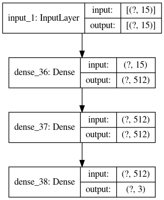
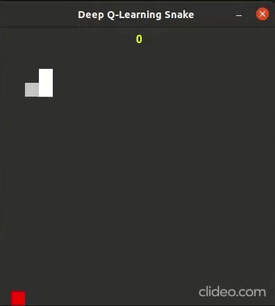

# Snake DQN

# A Reinforcement Learning Agent that plays Snake. The Deep Q-Network was created using Tensorflow

# Requirements
* numpy
* pygame
* tensorflow
* keras
* h5py

# Implementation

At each iteration, the agent receives the percepts from the state and chooses 1 out of 3 possible actions

Action | Meaning
------ | --------
0      | Turn Left
1      | Turn Right
2      | Continue moving in the same direction

### Percepts

Numpy array of size 15. All values are scaled between -1 and 1

Index  | Meaning
------ | --------
0      | Food X
1      | Food Y
2      | Orientation[0]
3      | Orientation[1]
4      | Is Food infront
5      | Is Food behind
6      | Is Food on the left
7      | Is Food on the right
8      | Snake Head X
9      | Snake Head Y
10     | Number of Moves remaining
11     | Obstacle on top
12     | Obstacle below
13     | Obstacle on the left
14     | Obstacle on the right

### Rewards

Event   | Reward
------  | --------
Away    | -1
Towards | 0.5
Hit     | 10
Dead    | -100
Stall   | -200

#### Reasons:
Inorder to survive the agent learns to avoid the walls and its body by moving in circles and not going after the food. Therefore, the penalty of -200 is received by the agent if it doesn't eat the food withing a specified number of moves.
In order to encourage the agent to go after the food, a positive reward is given to the agent if it moves towards the food and a negative reward is given to the agent if it moves away from the food.

### Network Architecture

# Demo

